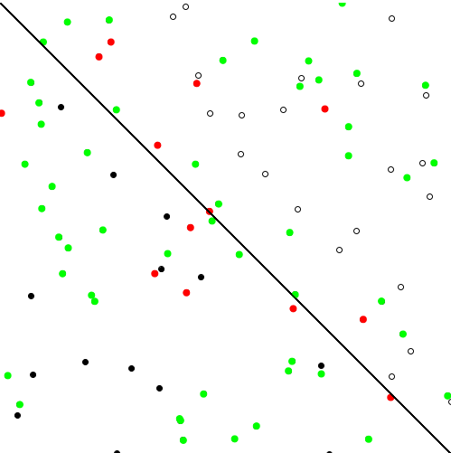
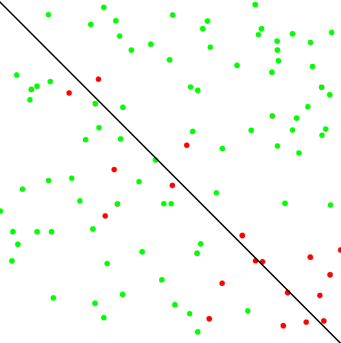
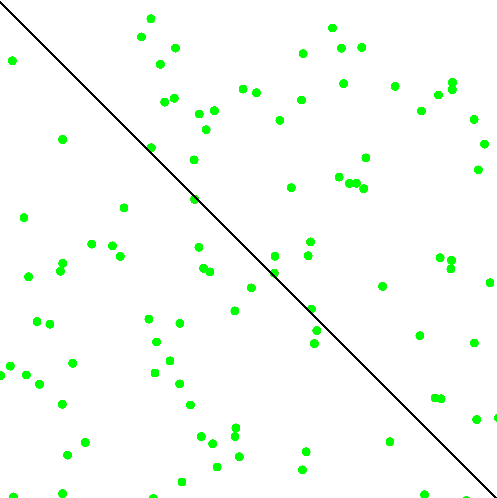
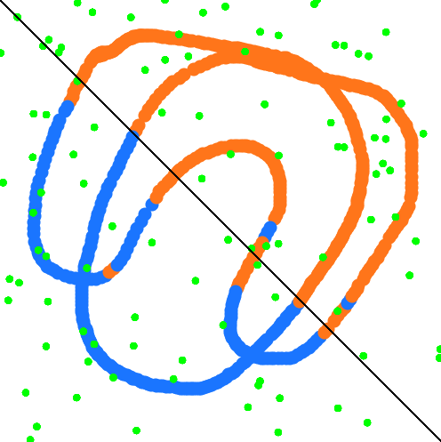

# Neural Networks Experiments:

## The perceptron:
This perceptron aims to classify points as 1 or -1 depending on what side of the line they are on.

#### Begin Training:

#### Half Trained:

#### Fully Trained:

#### Exapanding on the perceptron - classifying a drawn line as greater or less than a given boundary:
