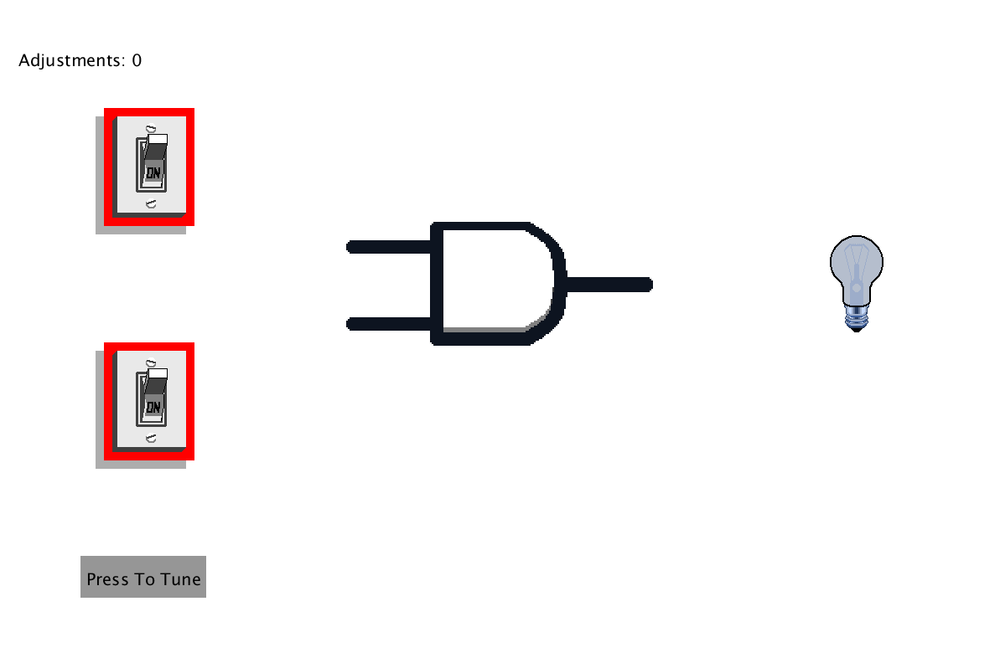
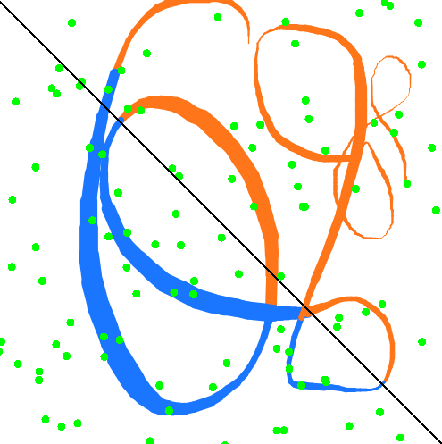
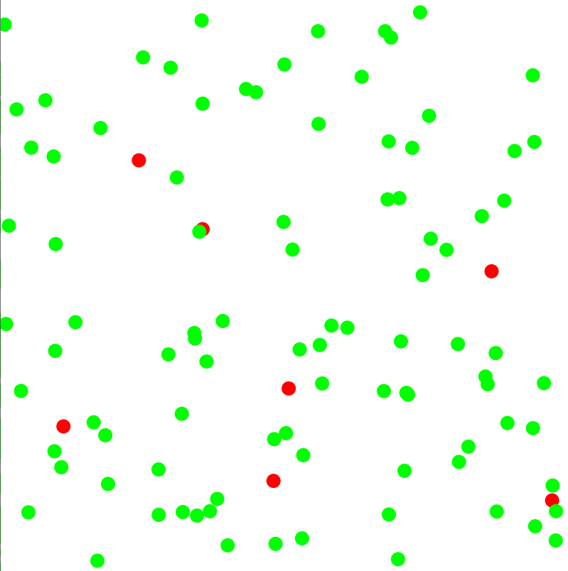
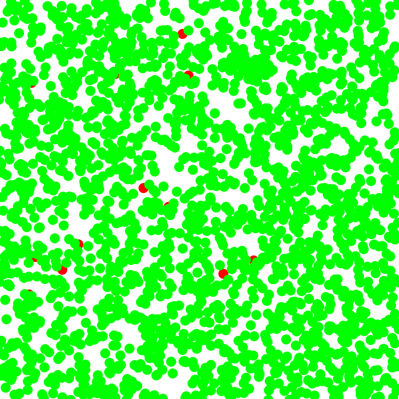
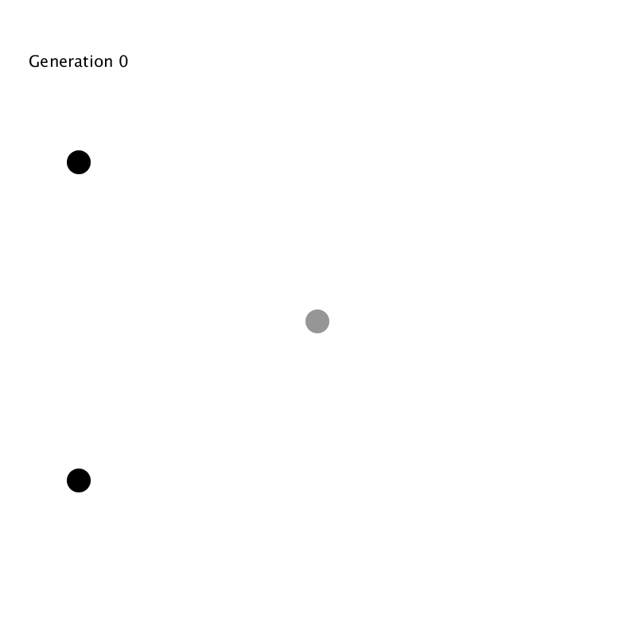
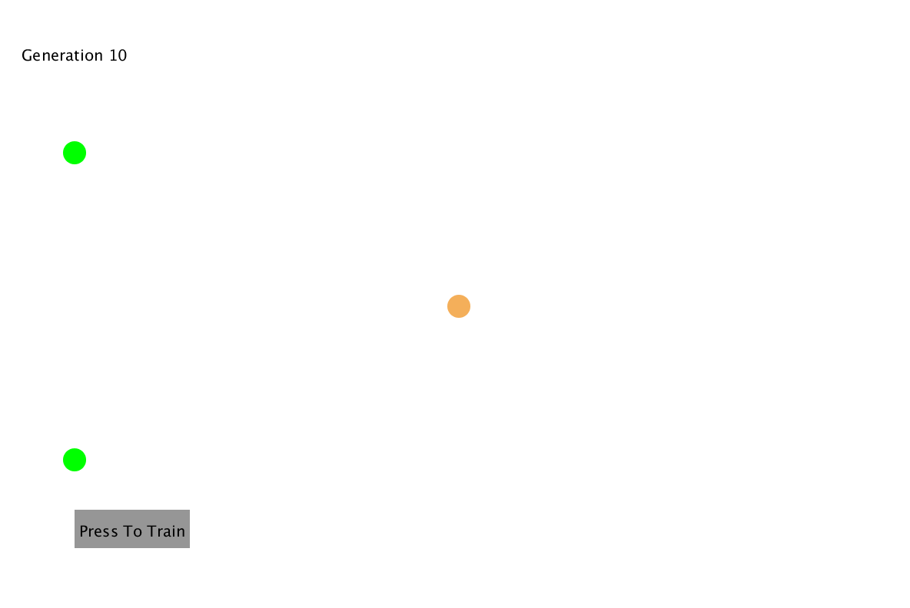

# Neural Networks Experiments:

# Final Perceptron:

## Visualised AND Gate Perceptron Complete (Using self made pixel art):

# Experimental Process:

## The perceptron:
This perceptron aims to classify points as 1 or -1 depending on what side of the line they are on.

#### Begin Training:

#### Half Trained:

#### Fully Trained:

#### Exapanding on the perceptron - classifying a drawn line as greater or less than a given boundary:

- This feature allows you to draw on the canvas. The line drawn will either be blue or orange depending on whether the perceptron guesses that this line is either on the left or right side of the boundary.

- This image shows the line after using linear interpolation to smooth the transitions when the weight of the line increases and decreases.

- The draw feature now has a thickness limit of 5px.

")

## AND gate perceptron

This perceptron will aim to give correct outputs for an AND gate, given input pairs of 0/1.

- Red circles represent incorrectly classified outputs for given inputs.
- Green represent correct classifications.

## Visualising the AND gate

In this extension of the and gate project, I intend to extend upon it and visualise it. I will keep track of each generation and let the user explore the outputs the perceptron has in each generation.

This will be extended further, animations and a more pleasant UI will be implemented.

- You can click on the inputs to change their value. Red is 0. Green is 1.
- There is a button for training the perceptron.
- You can see each output for a generation by changing the inputs (via a click on an input node).

