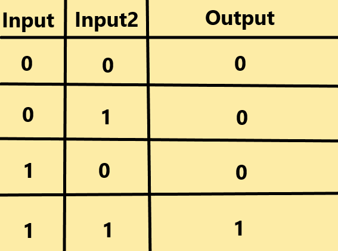

# AND Gate Perceptron

## AND gate - logic table:

## How it will be structured:

- I will create switches that I will use to turn the inputs into ones or zeros.

- I will aim to make it a visualisation of how the perceptron works.

## The perceptron needs to make a guess

- The guess of the perceptron will simply be the inputs * weights

- This will then be passed into the transfer/activation function.

## After the guess - We adjust it

- First we get the error rate;
    - desired_output - guess

- next we tune the weights
    - new_weight = error_rate * input * learning_rate

