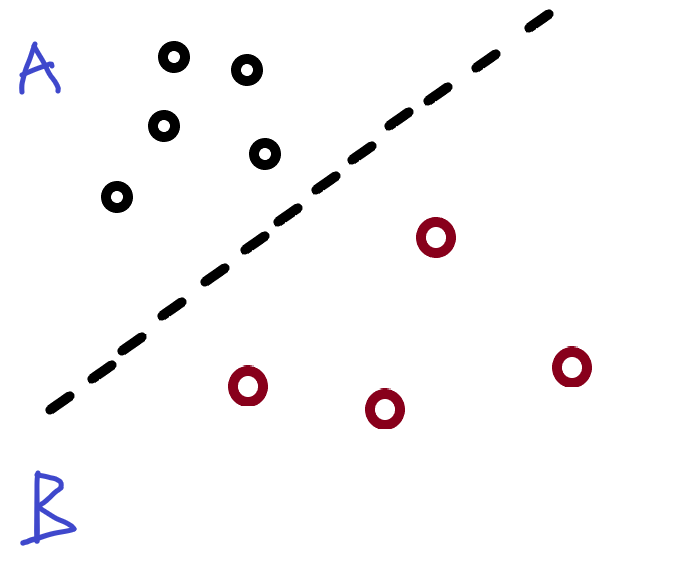

# The perceptron
(This idea follows a tutorial provided by Daniel Shiffman's Nature of Code series)

- It is the simplest type of neural network. 

- Its aim is to take inputs and gives a classification as an output.

---

## The problem we will try to classify:

- We want to classify points on a canvas as either A or B. This will depend on which side of the line they are on.

---

## How we will do this:

by gradient descent:

I will give the perceptron a point I know is in 'A'. If it gets it wrong I will modify it.

---

## weights:

- The inputs for the neural networks have weights.

The output is the inputs multiplied by the weights added together.

e.g. X1 * w1 + x2 * w2

---

## Activation function:

- It allows you to manipulate the output to a desired range.

---

## The outputs we want for the perceptron

- We want calssifications to A and B to be +1 or -1.

- To do this we will use the 'SIGN(N)' function.

    - if 'N' is positive I get a positive 1, if it is negative I get a -1

- If we get a zero, we will consider it a 1. This is a toy perceptron so it doesn't matter much.

--- 

## Initialising the neural network:

- The weights will be initialised as random in this scenario.

