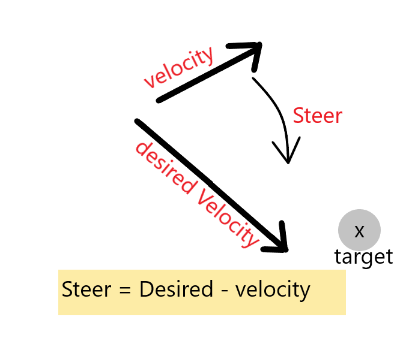

# The perceptron
(This idea follows a tutorial provided by Daniel Shiffman's Nature of Code series)

- It is the simplest type of neural network. 

- Its aim is to take inputs and gives a classification as an output.

---

## The problem we will try to classify:

- We want to classify points on a canvas as either A or B. This will depend on which side of the line they are on.

---

## How we will do this:

by gradient descent:

I will give the perceptron a point I know is in 'A'. If it gets it wrong I will modify it.

---

## weights:

- The inputs for the neural networks have weights.

The output is the inputs multiplied by the weights added together.

e.g. X1 * w1 + x2 * w2

---

## Activation function:

- It allows you to manipulate the output to a desired range.

---

## The outputs we want for the perceptron

- We want classifications to A and B to be +1 or -1.

- To do this we will use the 'SIGN(N)' function.

    - if 'N' is positive I get a positive 1, if it is negative I get a -1

- If we get a zero, we will consider it a 1. This is a toy perceptron so it doesn't matter much.

--- 

## Initialising the neural network:

- The weights will be initialised as random in this scenario.

## Modifying the weights when it is correct or incorrect:

- We will be using supervised learning

- Each time the perceptron takes inputs it will make a guess.

- I also have the answer.

- Therefore, I can work out the error by doing:
    - error = answer - guess

- Here we are trying to find the optimul weights.
 
--- 

## Gradient Descent

- Used to correct the error of the neural network

- You want to go some target "x"

    - therefore, its desired velocity - velocity is where it will steer

- In our perceptron the "desired" is our "answer", the "velocity" is the "guess", the "steering" is the "error" (where we want to go).
    - WE WANT TO STEER IN THE DIRECTION OF THE ERROR!

**In terms of maths:**

    Gradient(weight) = ERROR * INPUT

    NEW WEIGHT = WEIGHT + ERROR * INPUT * LEARNING RATE

---

## Learning rate:

- The learning rate is how much we want to "steer" the error (towards the correct target).

- We don't want to steer it all the way/alot because we can overshoot our desired direction.
    - That would cause us to not follow the path we want to go in

- Therefore, we only change the new rate by a small amount(to not over steer). That is why we multiply our new rate by a "learning rate". 

